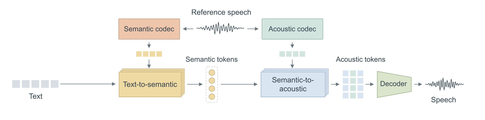
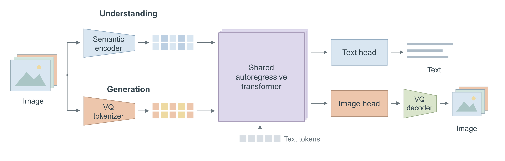
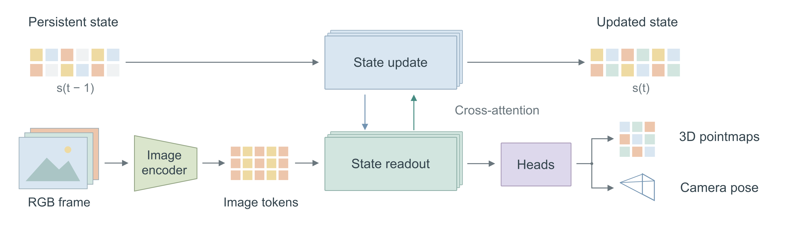
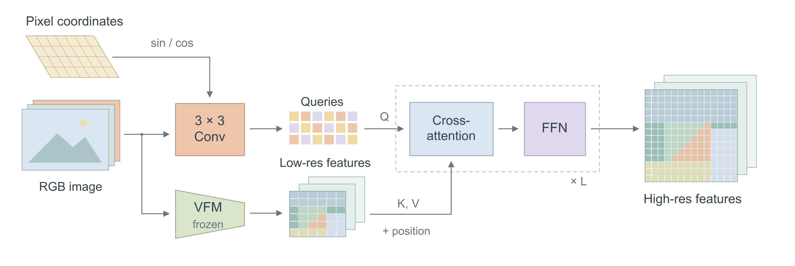
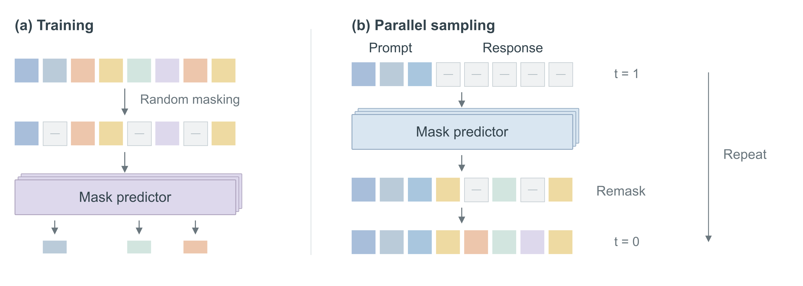
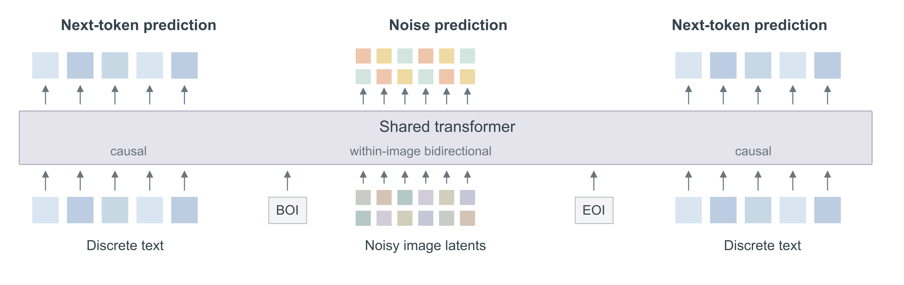

<div align="center">

<h1>Academic Diagram</h1>
<h3>Less text. Clearer structure. Figures worth showing.</h3>

<p>A compact agent skill for editable academic architecture diagrams and conceptual schematics.<br>Paper-first reasoning. Real visual references. Render, inspect, refine.</p>

<p><strong>English</strong> · <a href="README.zh-CN.md">简体中文</a></p>

<p>
  
  
  
</p>

<p><a href="#gallery">Explore the gallery</a> · <a href="#quick-start">Get started</a> · <a href="examples/academic-diagram-showcase.pdf">View the PDF</a> · <a href="SKILL.md">Read the skill</a></p>

</div>

---

## Gallery

**Six diagrams made with this skill.** These are reference-guided redesigns of published methods—not the authors’ original figures, blind-test outputs, or reproduced experiments. Tokens, waveforms and feature colors are illustrative. [Sources & scope →](examples/README.md)

### 01 / MaskGCT · Speech synthesis

Two generation stages. One reference voice. A clear path from text to speech.

<a href="examples/figures/02-maskgct.png"></a>

[PNG](examples/figures/02-maskgct.png) · [SVG](examples/figures/02-maskgct.drawio.svg) · [draw.io source](examples/figures/02-maskgct.drawio) · [Paper · ICLR 2025](https://proceedings.iclr.cc/paper_files/paper/2025/hash/74a31a3b862eb7f01defbbed8e5f0c69-Abstract-Conference.html)

---

### 02 / Janus · Multimodal architecture

Separate visual encoders. A shared autoregressive model. Task-specific outputs.

<a href="examples/figures/05-janus.png"></a>

[PNG](examples/figures/05-janus.png) · [SVG](examples/figures/05-janus.drawio.svg) · [draw.io source](examples/figures/05-janus.drawio) · [Paper · CVPR 2025](https://openaccess.thecvf.com/content/CVPR2025/html/Wu_Janus_Decoupling_Visual_Encoding_for_Unified_Multimodal_Understanding_and_Generation_CVPR_2025_paper.html)

<sub>The visual routes represent different tasks, not simultaneous inputs. The generation encoder provides training image codes; text-to-image inference starts from text.</sub>

---

### 03 / CUT3R · Persistent 3D state

Read the image. Update the state. Recover geometry through two interacting streams.

<a href="examples/figures/03-cut3r.png"></a>

[PNG](examples/figures/03-cut3r.png) · [SVG](examples/figures/03-cut3r.drawio.svg) · [draw.io source](examples/figures/03-cut3r.drawio) · [Paper · CVPR 2025](https://openaccess.thecvf.com/content/CVPR2025/html/Wang_Continuous_3D_Perception_Model_with_Persistent_State_CVPR_2025_paper.html)

---

### 04 / LoftUp · Feature upsampling

Coordinates become queries. Coarse features supply context. Detail emerges through cross-attention.

<a href="examples/figures/01-loftup.png"></a>

[PNG](examples/figures/01-loftup.png) · [SVG](examples/figures/01-loftup.drawio.svg) · [draw.io source](examples/figures/01-loftup.drawio) · [Paper · ICCV 2025](https://openaccess.thecvf.com/content/ICCV2025/html/Huang_LoftUp_Learning_a_Coordinate-Based_Feature_Upsampler_for_Vision_Foundation_Models_ICCV_2025_paper.html)

---

### 05 / LLaDA · Masked language modeling

A compact comparison of random-mask training and iterative parallel sampling.

<a href="examples/figures/04-llada.png"></a>

[PNG](examples/figures/04-llada.png) · [SVG](examples/figures/04-llada.drawio.svg) · [draw.io source](examples/figures/04-llada.drawio) · [Paper · NeurIPS 2025](https://proceedings.neurips.cc/paper_files/paper/2025/hash/48b383b24230e0e6e649d9c98dae4d8c-Abstract-Conference.html)

---

### 06 / Transfusion · Text meets diffusion

One transformer. Discrete text and continuous image latents. Two prediction objectives.

<a href="examples/figures/06-transfusion.png"></a>

[PNG](examples/figures/06-transfusion.png) · [SVG](examples/figures/06-transfusion.drawio.svg) · [draw.io source](examples/figures/06-transfusion.drawio) · [Paper · ICLR 2025](https://proceedings.iclr.cc/paper_files/paper/2025/hash/12678c3948153f4bc391f51e2082bd6e-Abstract-Conference.html)

<sub>Modalities are grouped schematically, not shown as exact shifted training targets. VAE and modality adapters are omitted.</sub>

---

## What makes the workflow different

| Paper first | Design with purpose | Refine the actual render |
| --- | --- | --- |
| Read the current manuscript and relevant workspace. Decide what the reader should understand. Keep the scientific structure honest. | Use short labels, meaningful shapes, restrained color, aligned components and deliberate whitespace. Learn from real paper figures. | Trace every arrow. Check typography and spacing at paper size. Fix the editable source, export again, and reopen the result. |

One compact [SKILL.md](SKILL.md). No mandatory image-generation step, fixed candidate count, or fixed iteration count. The skill focuses on **architecture diagrams, method overviews and conceptual schematics**—not quantitative charts or qualitative result grids.

## Quick start

Install the complete folder in a skill-compatible agent environment. For Codex, when the destination does **not** already exist:

```sh
git clone https://github.com/plbbl/academic-diagram-skill.git ~/.codex/skills/academic-diagram
```

Preserve the relative locations of `SKILL.md`, `agents/` and `references/`. Inspect an existing installation before changing it. Start a new session and ask:

```text
Use $academic-diagram to create an architecture or conceptual diagram from
my attached paper and its latest research workspace. Choose a relevant visual
reference, draw with editable objects in an isolated folder, inspect the render
at paper size, refine it, and deliver the editable source, SVG/PDF and PNG.
Do not modify my formal manuscript until I approve the figure.
```

Other agents can load [SKILL.md](SKILL.md) directly if their host supports local instructions. Drawing tools are supplied by the host: draw.io, PowerPoint, Canva, Illustrator or direct SVG. **This repository is a skill, not a bundled drawing application.** The six showcase examples use native draw.io objects and SVG.

**Want a single copy-paste prompt?** [中文一键使用提示词 →](GET_STARTED.zh-CN.md) It asks your agent to star the repository using an authorized account, load the skill, and begin with your paper. Starring is optional and never blocks use.

## Aesthetic reference atlas

The separate reference collection contains **30 paper-figure crops and 3 contact sheets**, supplied with metadata for 27 papers labeled 2025–2026. These are **third-party references, not skill outputs**. Select a suitable structure, then inspect the individual figure.

[Browse the source index](references/README.md) · [Figures 01–10](references/previews/overview-01.jpg) · [Figures 11–20](references/previews/overview-02.jpg) · [Figures 21–30](references/previews/overview-03.jpg)

## Files, credit & rights

- [Six-page showcase PDF](examples/academic-diagram-showcase.pdf) — vector figures with explanatory captions and paper links.
- [Editable examples](examples/figures/) — six `.drawio`, six native-text SVGs, and six 3000 px PNGs.
- [Example sources & limitations](examples/README.md) — method attribution, simplifications and editing notes.

Original skill instructions, agent configuration and documentation are covered by [MIT](LICENSE). That license does **not** automatically cover the showcase artwork or third-party reference images. See [example rights](examples/README.md#rights) and [third-party notices](THIRD_PARTY_NOTICES.md). The methods belong to their authors; inclusion does not imply endorsement. No unpublished papers, private research workspaces or experimental data are included.

<div align="center">
<br>
<strong>If this helps your research, a GitHub star helps others find it.</strong><br>
<sub>Keep the science precise. Let the figure do the explaining.</sub>
</div>
