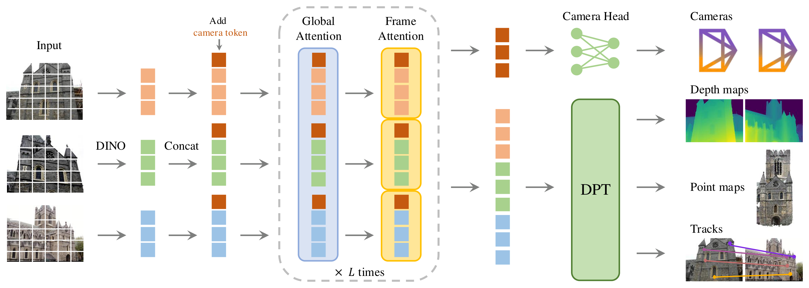

# Academic Diagram

A compact skill for editable, reference-guided academic architecture diagrams and conceptual schematics.

面向 Astra 等能够直接理解论文、设计和精修矢量对象的 agent。目标是：**科学内容凝练，图形表达丰富，排版规整，留白舒服。** 不接管整篇论文流程，不负责实验定量图或定性结果拼图。

## Skill 做什么

1. 确认最新论文与工作区，想清楚图要解释的科学关系。
2. 真正打开合适的论文参考图，学习布局、组件、配色和连线。
3. 用 draw.io、PowerPoint、Canva、Illustrator 或 SVG 的可编辑对象作图。
4. 对照参考与实际论文尺寸检查成图，精修，再检查。

主流程只有一个 [SKILL.md](SKILL.md)，没有强制图像生成、固定候选数、固定迭代轮数或额外状态机。工具按当前环境选择；本仓库不附带这些软件，也不假定相关插件已经安装。

## 安装与使用

将这个仓库作为一个完整 skill 文件夹安装，保留 `SKILL.md`、`agents/` 和 `references/` 的相对位置。Codex 用户可以在目标目录不存在时执行：

```sh
git clone https://github.com/plbbl/academic-diagram-skill.git ~/.codex/skills/academic-diagram
```

如果已有同名目录，先检查，不直接覆盖。重新打开会话后调用：

> 用 $academic-diagram，根据这篇论文的最新成稿和工作区做一张示意图。先选合适的美学参考，用可编辑对象画，在隔离目录精修，给我源文件、论文用图和预览。

默认不改正式论文；确认满意后，再明确要求替换。也可直接让其他支持本地 skill 的 agent 读取 `SKILL.md`；画图工具由宿主环境提供。

## 美学参考

包含用户提供的 **30 张独立论文图、3 张总览**，来源目录涵盖 27 篇标注为 2025–2026 年的论文。每张保留论文链接、图号、PDF 页序和可学习的设计特点。

[完整出处与选图索引](references/README.md) · [总览 01–10](references/previews/overview-01.jpg) · [总览 11–20](references/previews/overview-02.jpg) · [总览 21–30](references/previews/overview-03.jpg)

下面是**第三方参考图，不是这个 skill 生成的作品**：

| 可学习的设计 | 独立参考图与出处 |
|---|---|
| 主轴、token 阵列、对齐 | [VGGT · Fig. 2](references/figures/01_vggt_CVPR2025_fig2.png) |
| 有意义的时序堆叠和回路 | [SAM 2 · Fig. 3](references/figures/02_sam2_ICLR2025_fig3.png) |
| 用状态色块表达过程 | [LLaDA · Fig. 2](references/figures/21_llada_NeurIPS2025_fig2.png) |
| 简洁的双支路模块 | [MambaVision · Fig. 3](references/figures/29_mambavision_CVPR2025_fig3.png) |



参考来源：[VGGT: Visual Geometry Grounded Transformer](https://openaccess.thecvf.com/content/CVPR2025/html/Wang_VGGT_Visual_Geometry_Grounded_Transformer_CVPR_2025_paper.html)，CVPR 2025，Fig. 2。图片权利属于原权利人。

## 权利与范围

原创 skill 指令和原创说明采用 [MIT License](LICENSE)。`references/` 中的论文图、预览及原始出处目录**不适用这个 MIT 授权**；逐图来源见索引，权利说明见 [THIRD_PARTY_NOTICES.md](THIRD_PARTY_NOTICES.md)。本仓库不授予这些论文图片的再许可，也不代表原作者或会议背书。

仓库不包含任何未发表论文、实验数据或私有工作区内容。
